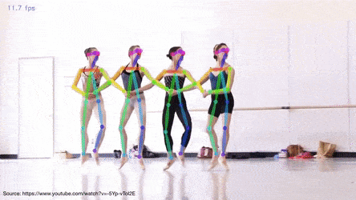

# GoogleColab_OpenPose
OpenPose Position Detection Using Google Colab

Step 1 : Take time to Build the OpenPose model

Step 2 : Select Youtube Video

Step 3 : Paste the ID of a YouTube Video

Step 4 : Run the Program 

    
